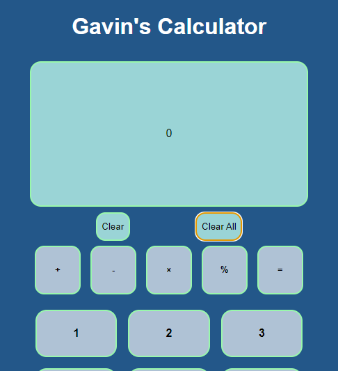

# Gavin's Calculator

This is my calculator website which I built as part of the  _Nology_ full stack development course.

The calculator makes use of html, scss, javascript as well as cypress for testing the application.

The calculator is hosed on GitHub pages here: https://gavinstirling.github.io/calculator/.

### Here is the preview:

